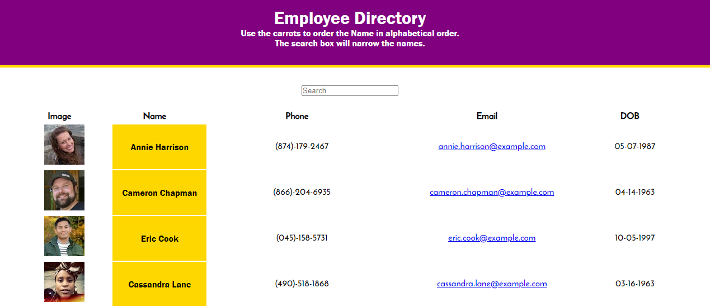
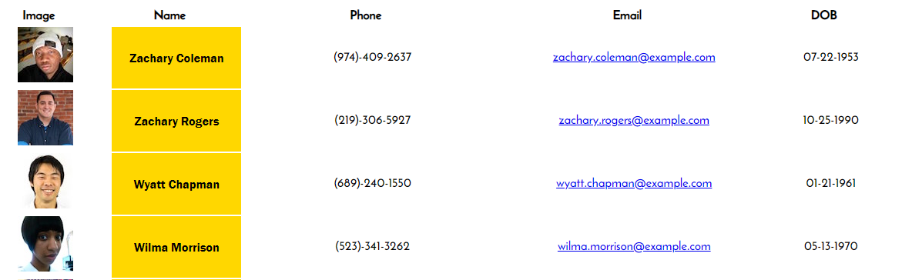

<!-- Employee Directory -->

  <h3 align="center">Employee Directory</h3>

  

    A web application that showcases a simply employee directory and sort function using randomly generated people.
     
    <a href="https://rpdurk.github.io/employeeDirectory/"><strong>Link to Live Website»</strong></a>
     
  

<!-- TABLE OF CONTENTS -->
## Table of Contents

* [About the Project](#about-the-project)
  * [Built With](#built-with)
* [Visit the Site](#visitTheSite)
* [Usage](#usage)
* [Contributing](#contributing)
* [License](#license)
* [Contact](#contact)

<!-- ABOUT THE PROJECT -->
## About The Project

[Employee Directory](https://rpdurk.github.io/employeeDirectory/)

This application allows you to showcase a directory of employee's and commonly maintained list of pertinent information.  Uses a simple filter by carrot function to order the list in alphabetical order or reverse alphabetical order.

### Built With
* [JavaScript](https://www.javascript.com/)
* [gitHub](https://www.gitHub.com/)
* [Random User API](https://randomuser.me/)

## Visit The Site

Visit the live website at [Here](https://rpdurk.github.io/employeeDirectory/)

## Usage

The primary purpose of this project is to show case employee personal and basic information.

1. Home Page
    

2. Sort by name
    

## Contributing

Contributions for this web application was made by 
* [Ryan Durk](https://github.com/rpdurk), 

<!-- LICENSE -->
## License

MIT License
